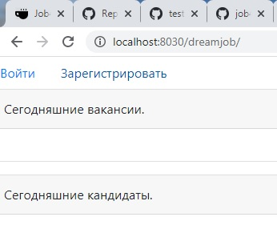
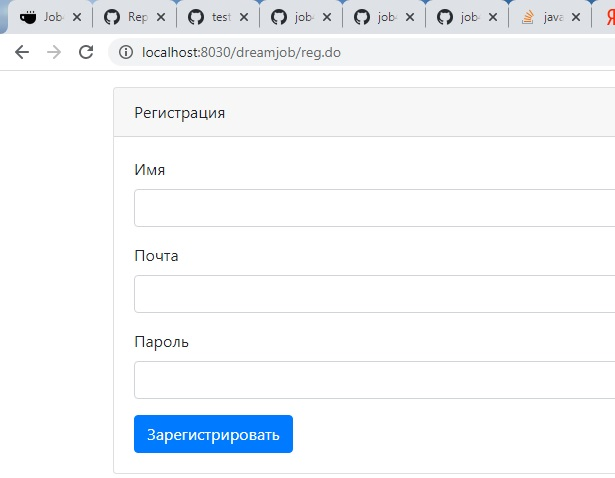
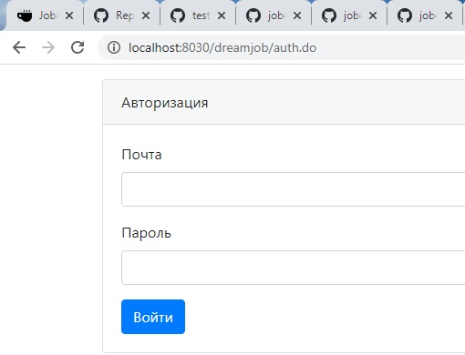
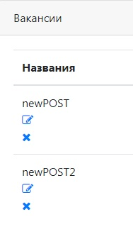
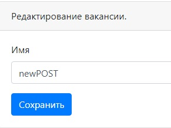
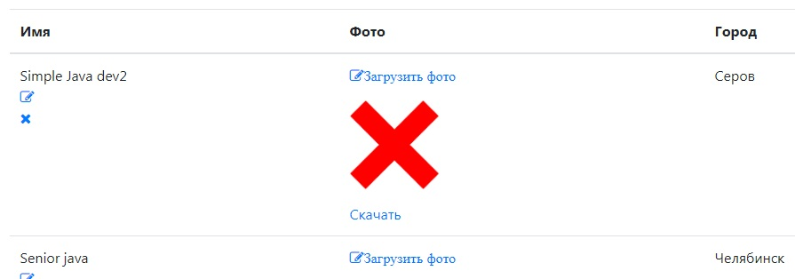
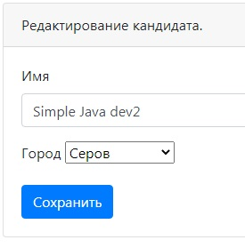
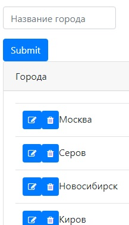

[GIT REPOSITORY](https://github.com/i3acsi/job4j_dreamjob.git)

Проект  "Работа мечты" - биржа работы

В системе представлны следующие модели:
 
 + пользователей системы
 + кандидаты
    + города
 + вакансии
- - -
Что реализовано на данный момент:
 
 
 В системе можно зарегистрироваться и залогиниться
 
 
 

 
 

 Регистрация
 
 
 

 
 

 
 Авторизация:
   
   есть AuthFilter - с его помощью можно реализовывать различные политики доступа к фнкционалу системы
 
 

 
 

 Посмотреть список вакансий
 
 
 

 
 

 Редактировать список вакансий
 
 
 

 
 

 Посмотреть список кандидатов, добавить фото
 
 
 
 
 
 

 Редактировать список кандидатов
 
 
 

 
 

 Посмотреть и отредактировать список городов для кандидатов
 
  
 

 
 ---
  Используемые технологии:
 1. Apache Tomcat — контейнер сервлетов
 2. Java servlets, MVC
 3. JSP, JSTL
 4. HTML, CSS, JS, Bootstrap, jquery ajax
 5. PostgreSQL 
 6. JUnit, Mockito, PowerMock
 7. Git, Travis CI, CodeCov